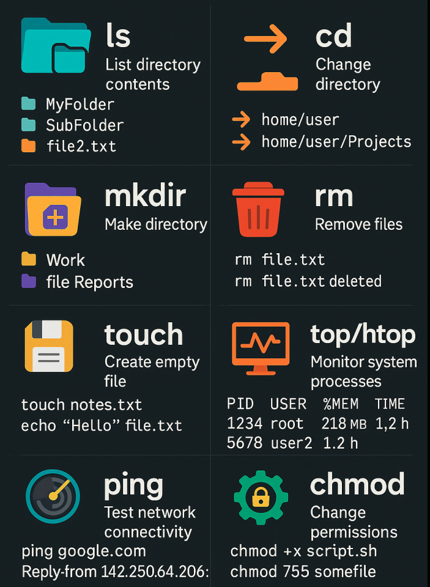

# linuxforbeginners - Day 01# 
# 🐧 Essential Linux Commands for Beginners

Welcome to the **Essential Linux Commands-Day01** repository!  
This project is designed to help **new Linux users** get comfortable with the command line by introducing some of the **most frequently used commands**—the ones every beginner should know and will use daily.

---

## 📸 Visual Guides

We've created beginner-friendly graphics to help you **visualize and remember** these commands more easily.

### 🔝 Top Command Usage
---

### 🔟 Top 10 Linux Commands

| Command | Description |
|---------|-------------|
| `ls`    | List directory contents |
| `cd`    | Change directories |
| `mkdir` | Create new folders |
| `rm`    | Remove files |
| `touch` | Create an empty file |
| `top` / `htop` | Monitor system processes |
| `ping`  | Test internet/network connectivity |
| `chmod`| Change file permissions |

---

## 📚 Why Learn These?

These are **foundational commands** for navigating Linux. Whether you're a:

- 🧑‍💻 Developer
- 🧪 Data Scientist
- ☁️ DevOps Engineer
- 🛠️ System Administrator  
... mastering these commands will boost your productivity and confidence on the terminal.

---

## 📥 Getting Started

If you’re new to Linux:

1. Open your terminal.
2. Start experimenting with the commands listed here.
3. Refer to the image guides for syntax and usage.

Want to go deeper? We recommend pairing this with a sandbox environment like:
- [Ubuntu in WSL](https://learn.microsoft.com/en-us/windows/wsl/install)
- [Online Linux terminals (like JSLinux or Webminal)](https://www.tutorialspoint.com/unix_terminal_online.php)

---

## 🤝 Contributing

Got a command you think every beginner should know?  
Have suggestions or want to contribute your own visual guide?

Feel free to:
- Open an issue 🐞
- Submit a pull request 📦
- Share your feedback 💬

---

## 🌍 Community & Sharing

Found this helpful? Give us a ⭐ and share it with someone learning Linux!  
Let’s build a beginner-friendly Linux community together.

---

## 📄 License

This project is licensed under the [MIT License](./LICENSE).

---

> *“The terminal might look intimidating at first, but it's one of the most powerful tools in your tech toolkit.”*

